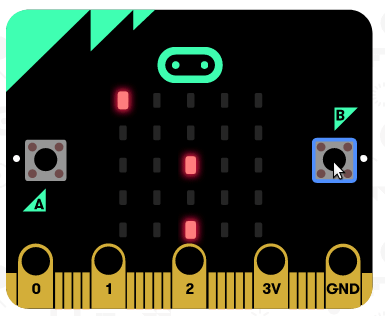

# [Microbit](http://microbit.org/) Projects for [kodinn.is](http://krakkaruv.is/heimar/kodinn)
These are projects made by students of University of Iceland, spring 2018.

## Projects

### [asteroids](https://github.com/geirgardarsson/microbit/tree/master/loftsteinar)

## Opening programs in browser

* Download the hex file.
* Go to **[the microbit editor](https://makecode.microbit.org/)**.
* Select **Projects**.
* Select **Import file**.
* Choose your hex file.
